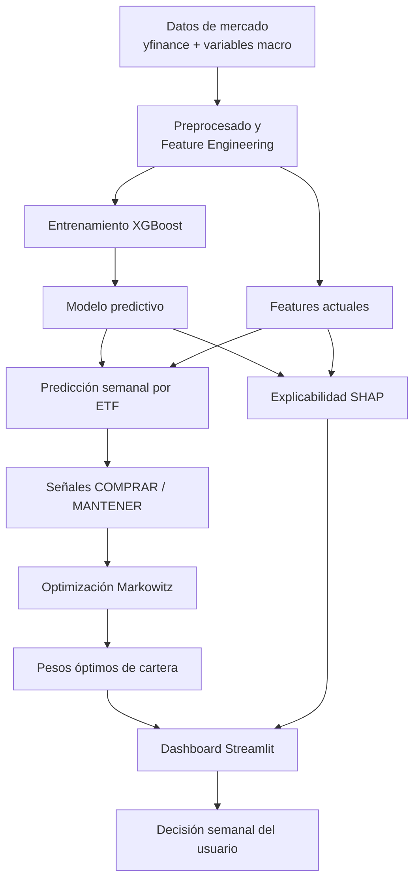
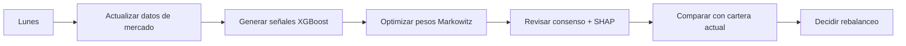

# 🤖 InvestBot-AI

> **Plataforma de optimización de carteras con Machine Learning, XAI y asistente LLM**
> Proyecto de Trabajo de Fin de Máster (TFM) — Universidad, 2025/2026

---

## 📌 Descripción

**InvestBot-AI** es una aplicación de gestión y optimización de carteras de inversión que combina métodos cuantitativos clásicos con Machine Learning moderno:

- 📊 **Optimización clásica** (Markowitz / Media-Varianza, frontera eficiente)
- 🧠 **Machine Learning predictivo** (XGBoost con validación walk-forward, 59% hit rate)
- 🔍 **Explicabilidad (XAI)** con SHAP values para entender las decisiones del modelo
- 📈 **Backtesting económico** sobre datos históricos reales (2019–2025)
- 🤖 **Asistente LLM** con RAG para consultas sobre la cartera
- 🗺 **Dashboard interactivo** en Streamlit con análisis en tiempo real

El proyecto opera sobre un universo de **7 ETFs europeos** y utiliza señales macroeconómicas (VIX, EUR/USD) como inputs principales del modelo predictivo.

---

## 🏆 Resultados Clave

> Evaluación en período bajista 2022–2025

| Estrategia | Retorno acumulado | Sharpe Ratio |
|---|---|---|
| Buy & Hold | -27.9% | -0.918 |
| Markowitz clásico | -34.7% | -1.164 |
| **InvestBot-AI (XGBoost)** | **+13.3%** | **+0.387** |

> El modelo supera a las estrategias clásicas en mercado bajista gracias a la **preservación de capital**: permanece en liquidez el 57% del tiempo cuando no detecta oportunidades.

**Variables más relevantes (SHAP):**
`eurusd_change_5d` > `vix_change_5d` > `eurusd` > `rsi_14` > `vol_21d`

---

## 🗺 Cómo funciona

---

## 🗓 Flujo de uso semanal

---

## 🧪 ETFs del Universo de Inversión

| Ticker | Nombre | Región |
|---|---|---|
| `CS1.PA` | iShares Core MSCI World | Global |
| `EUNL.DE` | iShares Core MSCI World | Europa |
| `FLXC.MI` | Franklin FTSE China | China |
| `VGWE.DE` | Vanguard FTSE All-World | Global |
| `XAIX.MI` | Xtrackers AI & Big Data | Tecnología |
| `XESC.MI` | Xtrackers MSCI Europe ESG | Europa ESG |
| `XMME.DE` | Xtrackers MSCI Emerging Markets | Emergentes |

---

## 🧠 Stack Tecnológico

| Categoría | Tecnología |
|---|---|
| **UI / Dashboard** | Streamlit, Plotly |
| **Machine Learning** | XGBoost, scikit-learn, Optuna |
| **Optimización** | PyPortfolioOpt |
| **Explicabilidad** | SHAP |
| **LLM / Chatbot** | OpenAI API, LangChain |
| **Datos** | yfinance, pandas, numpy, pandas-ta |
| **Persistencia** | SQLite, Parquet |

---

## 📊 Estado del Proyecto

| Fase | Estado |
|---|---|
| Exploración de datos e ingesta | ✅ Completada |
| Feature engineering | ✅ Completada |
| Modelado XGBoost + Optuna | ✅ Completada |
| Análisis SHAP / XAI | ✅ Completada |
| Backtesting económico | ✅ Completada |
| Integración pipeline + UI | 🔄 En progreso |
| Factor models + Memoria final | ⬜ Pendiente |
| Demo y presentación | ⬜ Pendiente |

---

## 👤 Autor

**Luis Rodríguez López**
Trabajo de Fin de Máster — 2025/2026
[GitHub](https://github.com/luisrodriguezlopez96)

---

> ⚠️ **Nota sobre el código fuente**
>
> El repositorio con el código fuente completo es **privado** por motivos académicos y de confidencialidad del TFM. Este repositorio público tiene como único fin mostrar la descripción, arquitectura y resultados del proyecto.
>
> *Los resultados de backtesting son exclusivamente con fines educativos y no constituyen asesoramiento financiero.*
